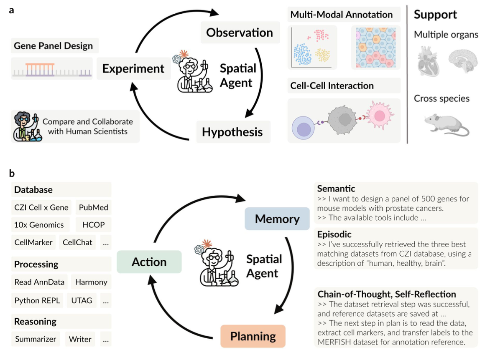

## SpatialAgent
This repository is the official implementation for the paper: **SpatialAgent: An autonomous AI agent for spatial biology**. Contact wang.hanchen@gene.com or hanchenw@stanford.edu if you have any questions.

### Overview

We present **SpatialAgent**, an autonomous AI agent dedicated for spatial-biology. SpatialAgent integrates large language models with dynamic tool execution and adaptive reasoning. SpatialAgent spans the entire research schema, from experimental design to multimodal data analysis and hypothesis generation.




### Citation

```bibtex
@article {spatialagent,
	author = {Hanchen Wang and Yichun He and Coelho Paula and Matthew Bucci and other},
	title = {SpatialAgent: An autonomous AI agent for spatial biology},
	doi = {10.1101/2025.04.01.646459},
	publisher = {Cold Spring Harbor Laboratory},
	URL = {https://www.biorxiv.org/content/early/2025/04/01/2024.04.01.646459}
	journal = {bioRxiv},
	year = {2025},
}
```


---


### Usage

*under construction*

### File Organization

```
SpatialAgent_dev/
├── data/                   # Data 
├── src/                     
│   ├── baseline/           # Baseline methods
│   ├── evaluation/         # Evaluation kit
│   ├── interface/          # Graphical user inteface
│   ├── script/             # Scripts to run representative tasks
│   ├── spatialagent/        
│   │   ├── agents/         # Agents
│   │   ├── plans/          # Plan templates
│   │   ├── tools/          # Tools 
│   │   ├── init.py         # Reorganized to final working version
│   │   ├── config.py       # Configurations
│   │   └── logger.py       # Logger
│   └── main.py             
│
├── .gitignore              # Git ignore
├── README.md               # Readme
├── chatui.sh               # Chat mode launch script
├── consoleui.sh            # Console mode launch script
├── env.yml                 # Environment dependencies
├── setup.sh                # All u need for setup
├── watcher.py              # Watcher to automatically reload while running GUI
└── teaser.png              
```


